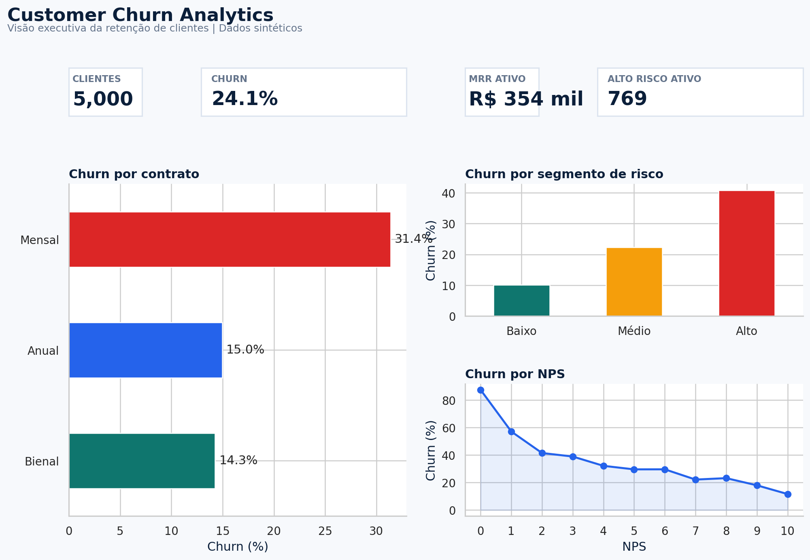
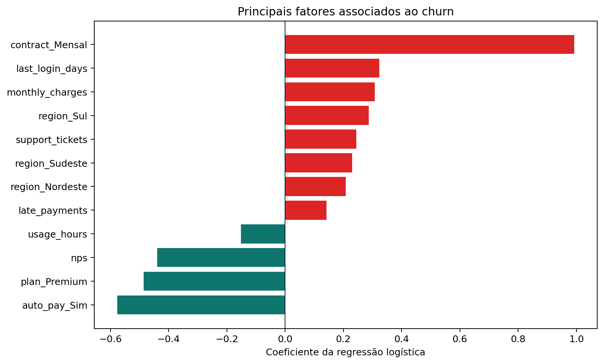

# Customer Churn Analytics

Projeto de portfólio end-to-end para identificar padrões de cancelamento, priorizar clientes em risco e transformar dados em recomendações de retenção.



## Objetivo de negócio

Uma empresa de serviços por assinatura precisa reduzir cancelamentos sem dispersar orçamento em ações genéricas. O projeto responde a quatro perguntas:

1. Qual é a taxa atual de churn e a receita associada aos cancelamentos?
2. Quais segmentos apresentam maior risco?
3. Quais fatores estão mais associados ao churn?
4. Quais clientes ativos devem ser priorizados por uma campanha de retenção?

## Principais resultados

| Indicador | Resultado |
|---|---:|
| Clientes analisados | 5.000 |
| Taxa de churn | 24,1% |
| MRR da base ativa | R$ 354,3 mil |
| Receita anual associada aos cancelamentos | R$ 1,42 milhão |
| Clientes ativos em alto risco | 769 |
| ROC AUC do modelo | 0,727 |

### Insights

- Contratos mensais apresentaram **31,4% de churn**, contra aproximadamente 15% nos contratos anuais e bienais.
- Clientes com NPS baixo, múltiplos chamados, atrasos e maior tempo desde o último acesso concentraram risco.
- Débito automático, maior engajamento e contratos mais longos estiveram associados à retenção.
- A segmentação de risco separou grupos com churn de aproximadamente 10%, 22% e 41%.

> A base é inteiramente sintética. Nenhum dado real de clientes foi utilizado.

## Solução desenvolvida

- geração reprodutível de 5.000 clientes sintéticos;
- validação, limpeza e engenharia de atributos com Python/Pandas;
- análise exploratória e visualizações executivas;
- consultas SQL com KPIs, segmentação, cohort e priorização;
- score de risco explicável para uso operacional;
- regressão logística com pipeline de pré-processamento;
- dashboard interativo em Streamlit;
- testes automatizados e workflow de CI.

## Tecnologias

`Python` · `Pandas` · `NumPy` · `SQL` · `Scikit-learn` · `Matplotlib` · `Seaborn` · `Streamlit` · `Plotly` · `GitHub Actions`

## Estrutura

```text
customer-churn-analytics/
├── dashboard/                 # Aplicação Streamlit
├── data/
│   ├── raw/                   # CSV e Excel com a base sintética
│   └── processed/             # Base limpa e enriquecida
├── notebooks/                 # Análise guiada em Jupyter
├── reports/                   # KPIs, modelo, resumo e figuras
├── sql/                       # Consultas de negócio
├── src/                       # Pipeline Python modular
├── tests/                     # Testes automatizados
└── .github/workflows/         # Integração contínua
```

## Como executar

### 1. Criar o ambiente

```bash
python -m venv .venv
```

Linux/macOS:

```bash
source .venv/bin/activate
```

Windows:

```powershell
.venv\Scripts\activate
```

### 2. Instalar e executar

```bash
pip install -r requirements.txt
python src/run_pipeline.py
```

### 3. Abrir o dashboard

```bash
streamlit run dashboard/app.py
```

### 4. Executar os testes

```bash
python -m unittest discover -s tests -v
```

## Consultas SQL

| Arquivo | Aplicação |
|---|---|
| `01_executive_kpis.sql` | KPIs de churn, MRR e receita em risco |
| `02_segment_analysis.sql` | Ranking de segmentos com window function |
| `03_retention_cohorts.sql` | Retenção por coorte de entrada |
| `04_priority_customers.sql` | Lista operacional de clientes prioritários |

## Modelo preditivo

Foi escolhida regressão logística por ser interpretável e adequada ao objetivo de explicar os drivers de churn. O pipeline inclui:

- padronização de variáveis numéricas;
- one-hot encoding de variáveis categóricas;
- divisão estratificada entre treino e teste;
- balanceamento por peso de classe;
- avaliação por ROC AUC, acurácia e relatório de classificação.



O modelo alcançou **ROC AUC de 0,727**. Como os dados são sintéticos, a métrica demonstra o método; não deve ser interpretada como desempenho em produção.

## Recomendações de negócio

1. Criar uma régua de retenção para clientes mensais de alto risco nos primeiros seis meses.
2. Acionar recuperação de experiência após o terceiro chamado de suporte.
3. Testar incentivo ao débito automático e migração para contrato anual.
4. Usar grupo de controle para medir uplift, receita preservada e ROI.
5. Monitorar estabilidade do score e qualidade dos dados antes de qualquer uso produtivo.

## Próximos passos

- conectar o pipeline a um banco PostgreSQL ou BigQuery;
- publicar o dashboard em ambiente cloud;
- adicionar monitoramento de drift;
- testar modelos de árvore e comparar explicabilidade versus ganho preditivo;
- implementar experimento de retenção com grupos de controle.

## Autor

**Murilo Silva** — Business Analytics, BI e Dados.

Projeto desenvolvido para portfólio profissional.